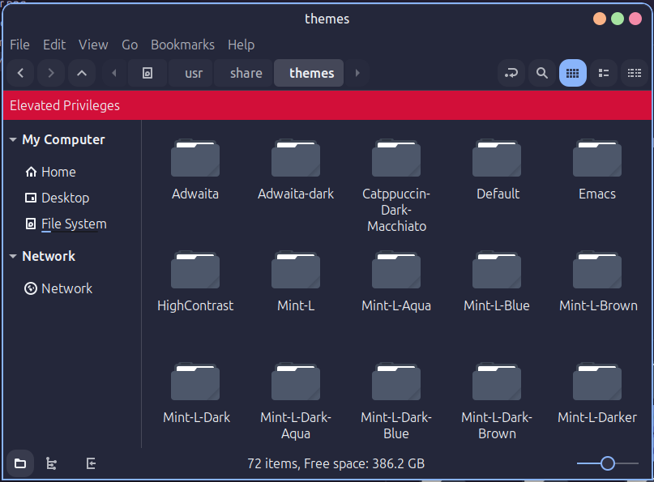
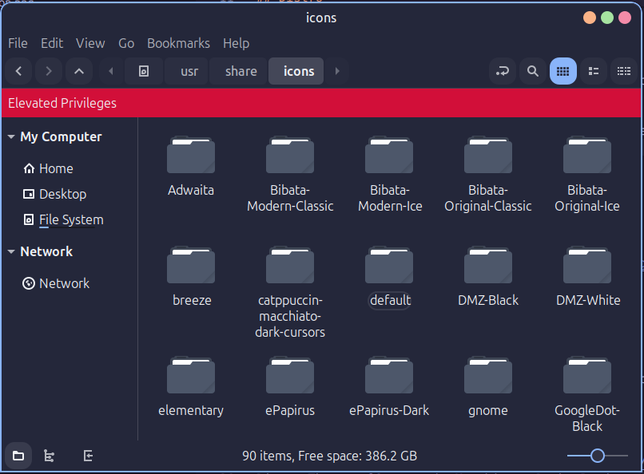
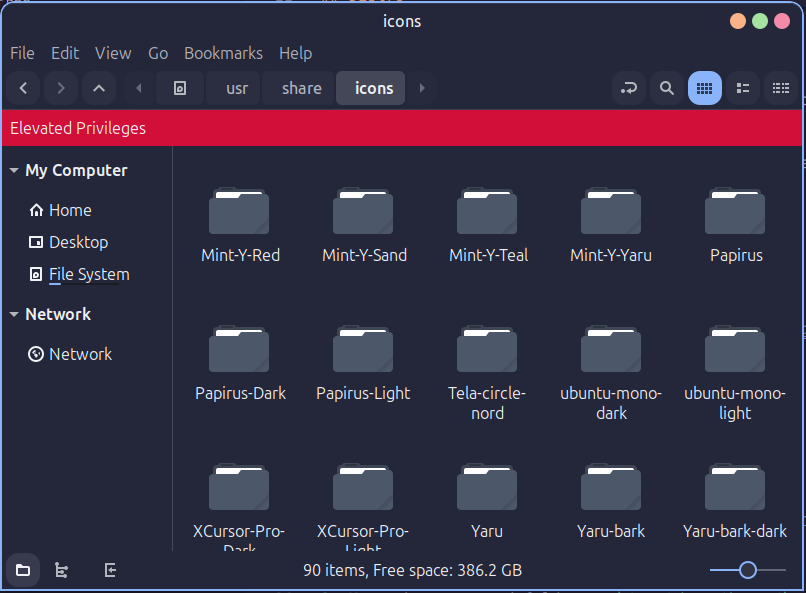

Work in Progress

# My Linux Setup

This  repository contains my personal Linux setup based on catppuccin themes

## Distro
This setup is based on the [Linux Mint Cinnamon](https://linuxmint.com/download.php) distribution. You can do it on any Linux distro, but the instructions here are tailored for Linux Mint Cinnamon.

## Distro Theme
To install all of these themes you might need root access.
### Application and Desktop Theme
I use the [Catppuccin Macchiato, Dark, Border, macOS Buttons](https://www.gnome-look.org/p/1715554/) theme for the desktop environment. Here are the steps to install it:
1. Download the theme from the link above.
2. Extract the downloaded archive.
3. Move the extracted folder to `/usr/share/themes/`

### Cursor Theme
Here I used the [Catppuccin Macchiato Dark](https://github.com/catppuccin/cursors) cursor theme. To install it:
1. Download the theme from the link above.
2. Extract the downloaded archive.
3. Move the extracted folder to `/usr/share/icons/`

### Folder Theme
Here I used the [Tela Circle Nord](https://www.gnome-look.org/p/1359276/) folder theme. To install it:
1. Download the theme from the link above.
2. Extract the downloaded archive.
3. Move the extracted folder to `/usr/share/icons/`

After installing all the themes, follow these steps:
1. Open the "Themes" settings in Linux Mint.
2. Select the Catppuccin-Dark-Macchiato theme in both the "Applications" and "Desktop" sections.
3. Set the "Mouse Pointer" theme to Catppuccin Macchiato Dark.
4. Set the "Icons" theme to Tela Circle Nord.

