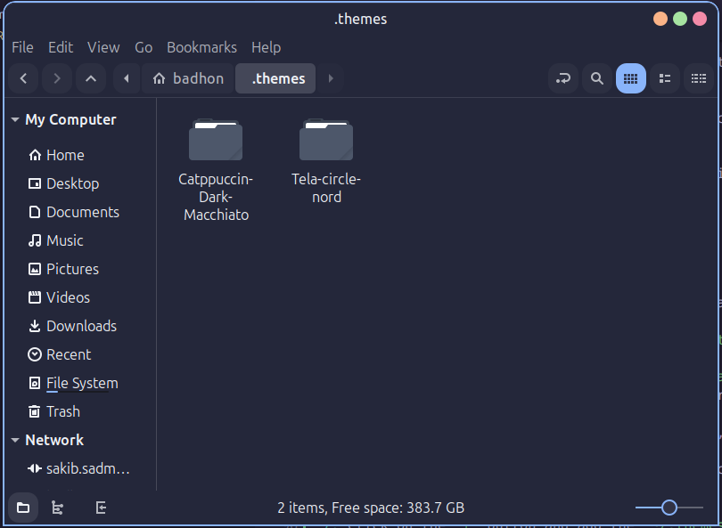
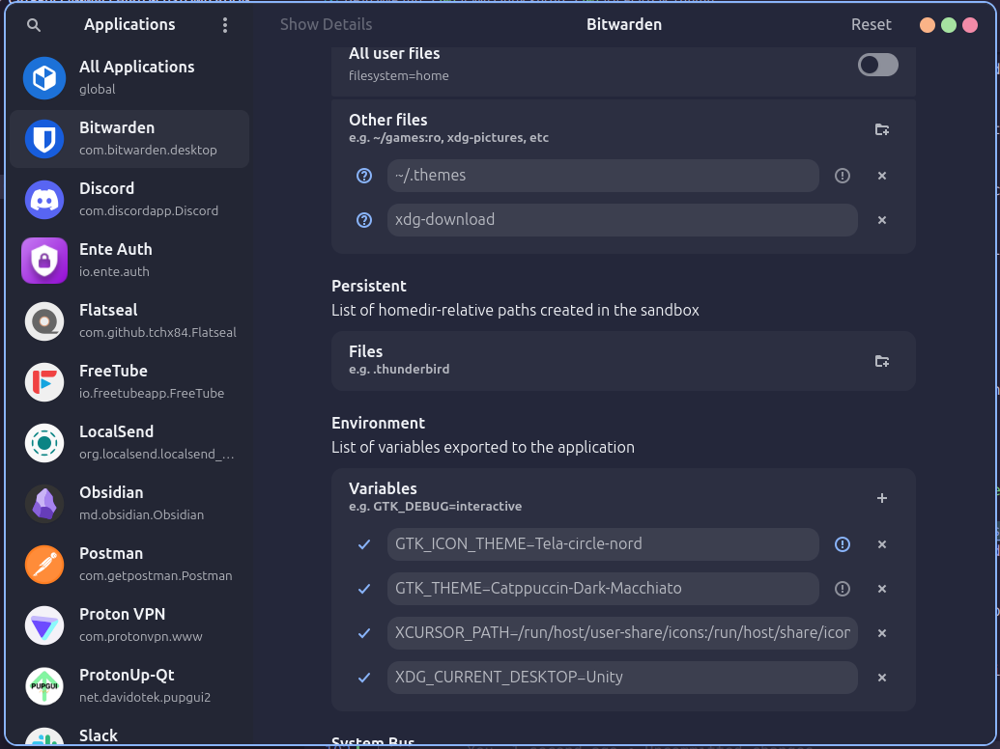
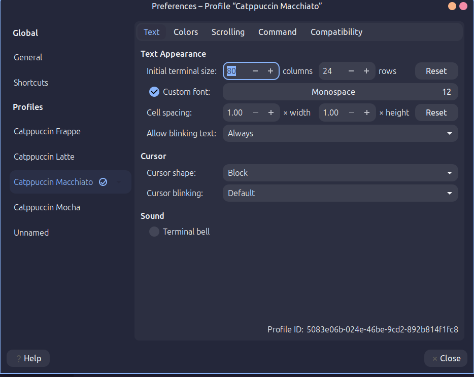
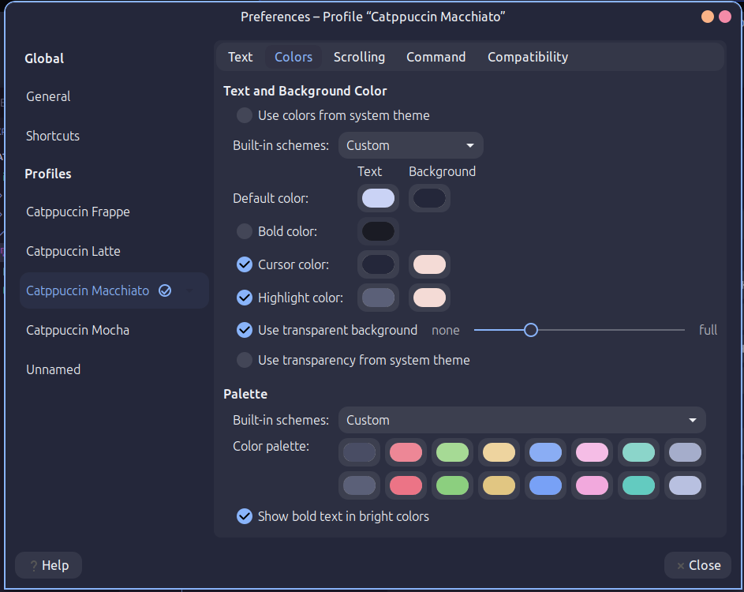

<div align="center">

<p style="color: red; font-weight: bold; font-size: 18px;">Work in Progress</p>

# My Linux Setup


This repository contains my personal Linux setup based on catppuccin themes

</div>

## Distro

This setup is based on the [Linux Mint Cinnamon](https://linuxmint.com/download.php) distribution. You can do it on any Linux distro, but the instructions here are tailored for Linux Mint Cinnamon.

## Distro Theme

To install all of these themes you might need root access.

### Application and Desktop Theme

I use the [Catppuccin Macchiato, Dark, Border, macOS Buttons](https://www.gnome-look.org/p/1715554/) theme for the desktop environment. Here are the steps to install it:

1. Download the theme from the link above.
2. Extract the downloaded archive.
3. Move the extracted folder to `/usr/share/themes/`


### Cursor Theme

Here I used the [Catppuccin Macchiato Dark](https://github.com/catppuccin/cursors) cursor theme. To install it:

1. Download the theme from the link above.
2. Extract the downloaded archive.
3. Move the extracted folder to `/usr/share/icons/`


### Folder Theme

Here I used the [Tela Circle Nord](https://www.gnome-look.org/p/1359276/) folder theme. To install it:

1. Download the theme from the link above.
2. Extract the downloaded archive.
3. Move the extracted folder to `/usr/share/icons/`


After installing all the themes, follow these steps:

1. Open the "Themes" settings in Linux Mint.
2. Select the Catppuccin-Dark-Macchiato theme in both the "Applications" and "Desktop" sections.
3. Set the "Mouse Pointer" theme to Catppuccin Macchiato Dark.
4. Set the "Icons" theme to Tela Circle Nord.

### Wallpaper

For this section you can use any wallpaper you like. I personally use a custom wallpaper that matches the Catppuccin Macchiato theme. I have used [this wallpaper](https://raw.githubusercontent.com/orangci/walls-catppuccin-mocha/master/purpled-night.jpg). You can find various wallpapers on the following github repositories.

- [orangci/walls-catppuccin-mocha](https://github.com/orangci/walls-catppuccin-mocha)
- [zhichaoh/catppuccin-wallpapers](https://github.com/zhichaoh/catppuccin-wallpapers)

## QtTheme

It is necessary to install as many apps do not support GTK themes. To do this properly you have to install multiple packages. Here are the steps:

1. Open a terminal and run the following command:
   ```bash
   sudo apt install qt5ct qt6ct qt5-style-plugins qt6-style-plugins kvantum qt5-style-kvantum qt6-style-kvantum
   ```
2. After installation, open write the following command in the terminal:
   ```bash
   sudo xed ~/.profile
   ```
3. Add the following lines to the end of the file:
   ```bash
   export QT_QPA_PLATFORMTHEME=qt5ct
   export QT_STYLE_OVERRIDE=kvantum
   ```
4. Save the file and close it.
5. Run the following command to apply the changes:
   ```bash
   source ~/.profile
   ```
6. Open the browser and go to [this link](https://github.com/catppuccin/Kvantum). From there download the catppuccin-macchiato-blue theme.

7. After downloading all the files from there just create a folder and place all the files in it.

8. After that open the kvantum manager and select the folder you created as the theme folder then install the theme.

9. After that go to Change/Delete Theme and select the Catppuccin Macchiato or whatever you named the theme.

10. You can also change the theme by color by going to the qt5 and selecting the kvantum theme, but it is not necessary.

11. Restart your computer to apply the changes.

## Flatpak Theme

To apply the Catppuccin Macchiato theme to Flatpak applications, you need to install the `flatseal` application. Here are the steps:

1. Open the software manager and search for `flatseal`.
2. Install the `flatseal` application.
3. Open `flatseal` and and go to the `All Applications` section.
4. Before putting any value open the file manager and go to the `/home/<username>/.themes` directory.
5. Paste the [Catppuccin Macchiato, Dark, Border, macOS Buttons](https://www.gnome-look.org/p/1715554/) theme on that directory. Also, paste the [Tela Circle Nord](https://www.gnome-look.org/p/1359276/) also in the same directory.
   
6. Now go back to `flatseal` and select the `All Applications` then go the `Filesystem` section.
7. Click on the `+` button and add the `~/.themes` directory.
8. After that go to the `Environment` section and add the following lines:
   ```bash
   GTK_THEME=Catppuccin-Macchiato-Dark-Border-MacOS
   GTK_ICON_THEME=Tela-Circle-Nord
   ```



9. Now you can close the `flatseal` application and restart your computer to apply the changes.

## Gnome Terminal
To apply the Catppuccin Macchiato theme to Gnome Terminal, follow these steps:   
1. Downolad the `terminal.txt` file from this repository.
2. Open the Terminal and paste the following command:
   ```bash
   dconf load /org/gnome/terminal/ < terminal.txt
   ```
3. Then go to the preferences and select the `Catppuccin Macchiato` profile.


4. I have also modified transparent settings, so you can adjust the transparency level according to your preference.

